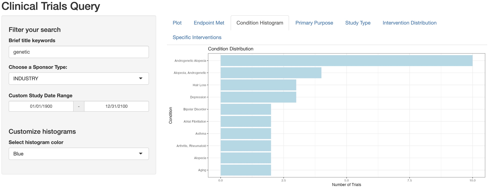
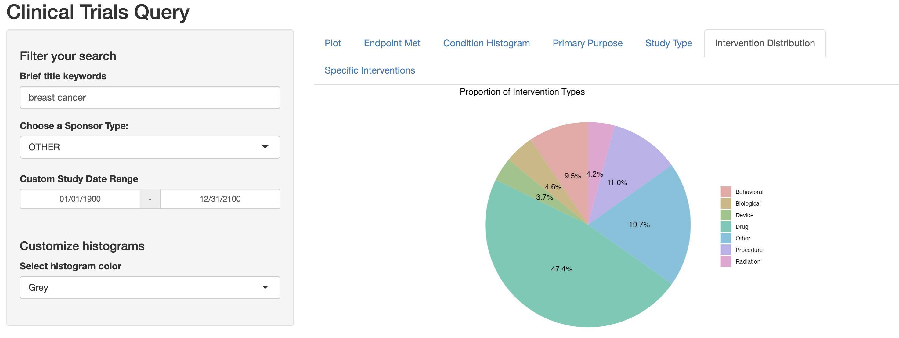

<!-- README.md is generated from README.Rmd. Please edit that file -->

# bis620.2023

<!-- badges: start -->

[](https://github.com/Yukodeng/bis620.2023/actions/workflows/R-CMD-check.yaml)

<!-- badges: end -->

The *bis620.2023* project integrates the Clinical Trials Query Shiny app we built in the last homework assignment into an R package, which allows easier management of the app features and testing of its functionality.

## Installation

You can install the development version of bis620.2023 from [GitHub](https://github.com/) with:

``` r
install.packages("devtools")
install_github("Yukodeng/bis620.2023")

# Or alternatively:
devtools::install_github("Yukodeng/bis620.2023")
```

## Example

This is a basic example which shows you how to solve a common problem:

``` r
library(bis620.2023)
accel |> 
  head(100) |> 
  plot_accel()
```


To launch the Clinical Trials Query application, use `run_application()`. Query the clinical trials data by typing in or selecting values in the search fields:

``` r
library(bis620.2023)
run_application()
```




